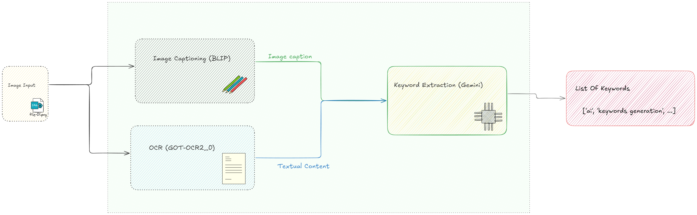

# Graphical Keywords Generator

## Project Description

This is an implementation of a pipeline that combines image captioning and Optical Character Recognition (OCR) to process images, generate captions, and extract keywords from the images. The generated keywords can then be used to enhance search accuracy in search engines.

This project uses:
- **BLIP** for image captioning, generating descriptions of the image content.
- **GOT-OCR2_0** for extracting text from the image using OCR.
- **Google Gemini** to generate relevant keywords from the outputs of the captioning and OCR tools.

## Architecture

Below is a high-level diagram showcasing the architecture of the pipeline:

1. **Image Input**: The input image is processed by two components:
   - **Image Captioning (BLIP)**: Generates a textual caption describing the content of the image.
   - **OCR (GOT-OCR2_0)**: Extracts any textual content that might be present in the image.

2. **Keyword Extraction**: The outputs of the image captioning and OCR tools are combined and processed to generate a list of keywords that represent the image content.

## Technologies Used

- **BLIP** (Bootstrapping Language-Image Pretraining) for image captioning
- **GOT-OCR2_0** for optical character recognition (OCR)
- **Google Gemini** for keyword generation from text
- **Langchain** for chaining the tools together

## Group Members

- *Boutslighoi Anass*
- *Brim Abdessamad*
- *Chahboune Achraf*
- *El Mednaoui Amine*
- *El Hadrami Oussama*
- *Qara Younes*
